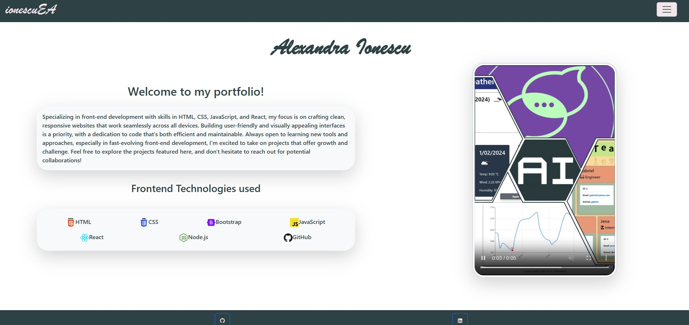
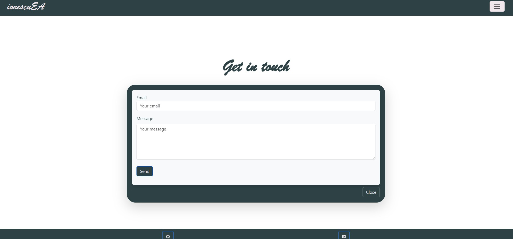
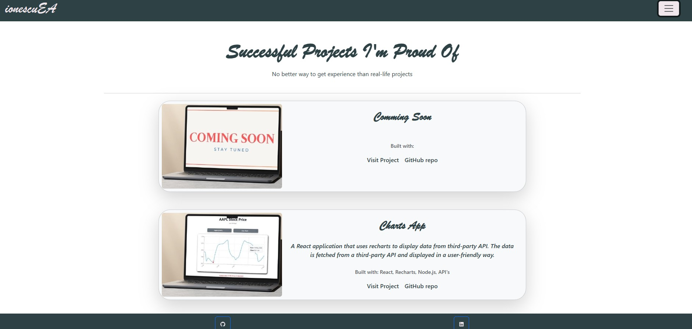

# Alexandra Ionescu Portfolio

## Description

Alexandra Ionescu's Portfolio using React.

## Instalation

The website page can be accessed here [Netlify](https://alexandra-ionescu-portfolio.netlify.app/).

## Usage

The main page, Home, displays the name, name-brand, a photo, a statement and some 'about' information. The name-brand, when clicked, is linked to the Home page.

On the right side, there is a navbar-toggler that, when clicked, will display a menu (Home, Contact and Project Gallery).

The Contact page displays a modal that can be used to contact Alexandra via a form, by sending an email.

The Project Gallery page, displays a number of Alexandra's projects. Every project can be accessed via link on the deployed page or GitHub. Also, it has info about the project and what programm languages were used.

As the Navbar, the Footer is displayed on all pages. The Footer also contain links to: GitHub, Email, Resume and LinkedIn.

## Credits

[Alexandra Ionescu](https://github.com/ionescuea)

## License

Licensed under the [MIT](LICENSE) license.
